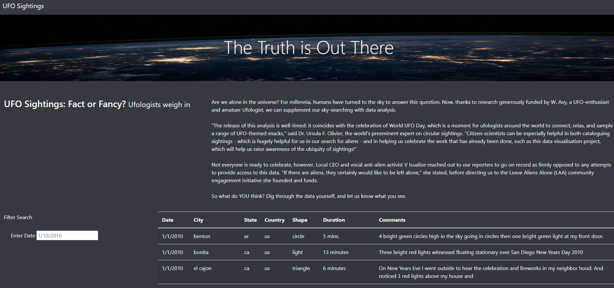

## UFOs
### Module 12 JavaScript

#### Project Overview
  In order to help Dana perform a more in-depth analysis of the UFO sightings with more fitlers for the users to search multiple criteria at the same time. Therefore 
  expanding the search capabilities. There will be added filters for the city, state, country, shape, as well as date. We will achieve this by using the skills learned 
  in this module on Javascript.

### Results

This new versions provides a more detailed search to enhance the users experiencce. From the homepage it is easy to identify the search bar, as well as each option a 
user would like to narrow or widen a search. They could filter by city, state, and even country, the date, as well as the UFO shape. By simply selecting the filters you
would like to use you can refine searches easily. 

### Summary

In summary, while these changes have been highly effective, it is still a rough draft. The user experience was improved by adding quite a few options that would really
assist them in their search.  I believe in order to improve this further, there should be more fitlers applied, continue testing, and create the best possible user 
experience.

